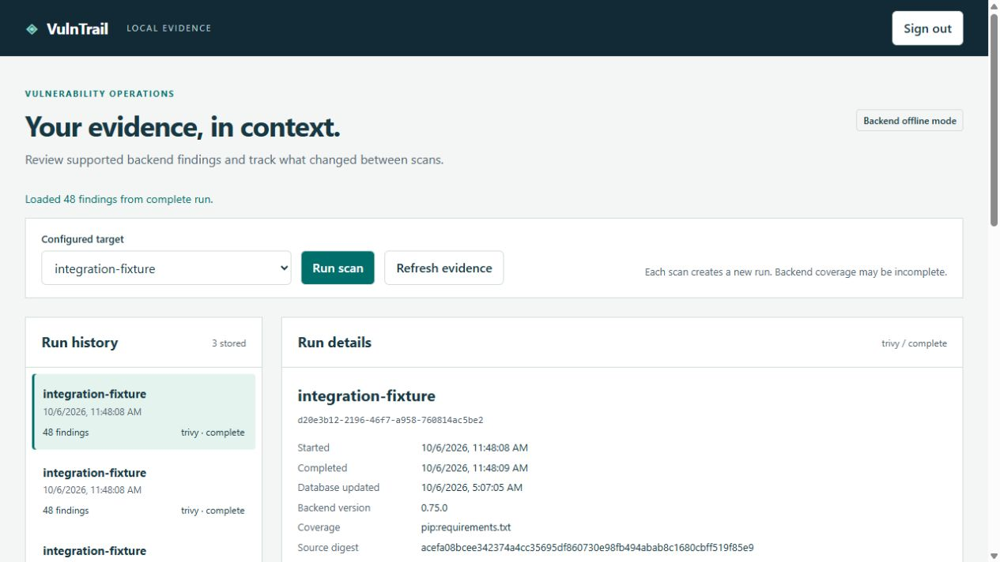

# VulnTrail

Local-first vulnerability scanning with evidence you can revisit.

VulnTrail runs **real Trivy filesystem scans**, keeps immutable snapshots in
SQLite, and explains what changed without turning incomplete coverage into a
false clean bill of health. Use the CLI, local browser dashboard, or terminal UI.
No hosted account is required. The dashboard is not a hosted multi-user service.



This example scans a deliberately outdated test project, not a user's device.

## What works

- Authorized local project/directory scans using a separately installed Trivy.
- Offline scans with a pre-provisioned vulnerability database; explicit failures
  when the engine or database is missing, and database age warnings.
- Opt-in recurring scans, bounded execution, severity-based CI exit codes.
- Trivy and Grype JSON imports with source-aware package identity.
- Snapshot history, cautious comparisons, JSON/Markdown/escaped HTML reports.
- Local CISA KEV and FIRST EPSS feed enrichment with hashes and source dates.
- Human-reviewed upgrade plans. Optional exact-digest artifact hold/restore,
  never automatic package upgrades or privileged remediation.
- Authenticated loopback-only API and dashboard; searchable/filterable findings,
  scan controls, history, comparisons, and report downloads.

**Scope:** this is an evidence orchestrator, not a new vulnerability database or
exploit detector. Finding counts come from the backend and can contain false
positives. Trivy filesystem coverage is not an inventory of every installed
Windows/macOS/Linux application, network service, kernel, or remote host. No
network probing, credentials discovery, Docker socket access, or malware execution.

## Quick start

Python 3.11+ is required. Clone this repository and install
[uv](https://docs.astral.sh/uv/getting-started/installation/) from its official source:

```sh
uv sync --locked --no-dev
uv run --no-sync vulntrail init config.yaml --target my-app=/absolute/path/to/project
```

On Windows, use an absolute path such as `C:/Projects/my-app`.
Configuration paths are relative to the configuration file. Review the generated
file, especially the authorized targets, `trivy_path`, and `cache_dir`.

Install [Trivy](https://trivy.dev/docs/latest/getting-started/installation/) from
its official distribution and verify the release. Provision its database while
online using the **same cache directory** configured in VulnTrail:

```sh
trivy filesystem --cache-dir ./.vulntrail/cache --download-db-only --disable-telemetry --skip-version-check --no-progress
uv run --no-sync vulntrail doctor
uv run --no-sync vulntrail scan my-app
uv run --no-sync vulntrail runs
```

For Java coverage, separately provision the Java database if the backend needs it:
`trivy filesystem --cache-dir ./.vulntrail/cache --download-java-db-only`.
An offline Java scan can fail when this additional database is absent.
VulnTrail never silently downloads an engine or switches offline mode off.
Offline flags are not an operating-system network firewall. For air-gapped
workflows, transfer the engine, Python wheels, and compatible databases ahead of
time and enforce network denial separately. See [operations](docs/OPERATIONS.md).

## History, reports, and continuous scans

Replace `RUN_ID`, `BEFORE_ID`, and `AFTER_ID` with IDs printed by actual scans:

```sh
uv run --no-sync vulntrail show RUN_ID
uv run --no-sync vulntrail diff BEFORE_ID AFTER_ID
uv run --no-sync vulntrail report RUN_ID --format html --output report.html
uv run --no-sync vulntrail watch my-app --interval 3600
uv run --no-sync vulntrail scan my-app --fail-on HIGH
uv run --no-sync vulntrail tui
```

`watch` runs in the foreground until interrupted. Add `--count 2` for two scans.
Configure your own scheduler/service if you need unattended startup; VulnTrail
does not install a background service. Exit codes: 0 complete without a requested
severity failure, 1 requested severity observed, 2 failed/partial/invalid operation,
130 interrupted. No findings means no findings **in reported coverage**, not safe.

## Local dashboard

```sh
uv run --no-sync vulntrail serve
```

Enter a private random token of at least 32 characters at the hidden terminal
prompt, then use that token to sign in at `http://127.0.0.1:8765`.
Generate it with your password manager. `VULNTRAIL_TOKEN` is supported for
user-managed process environments; never commit it or put it in a URL. Tokens
are not printed by the server. Dashboard sessions last one hour and restart
invalidates them. HTTP is limited to direct loopback connections, with no proxy
support. Do not publish this service to the internet or a LAN.

API clients use `Authorization: Bearer <your-token>` at `/api/v1`. Browser sessions
use HttpOnly SameSiteStrict cookies, not local/session storage. See
[API and data contracts](docs/CONTRACTS.md).

## Imports and prioritization

```sh
uv run --no-sync vulntrail import trivy.json --backend trivy --target imported-app
uv run --no-sync vulntrail import grype.json --backend grype --target imported-image
uv run --no-sync vulntrail enrich RUN_ID --kev kev.json --epss epss.csv
uv run --no-sync vulntrail response RUN_ID
```

Imports do not prove which machine was scanned or database freshness. Imported
snapshots without verified target identity cannot prove disappearance. Enrichment
creates a new snapshot, retaining the original scan date. KEV is known exploitation
context; EPSS is population-level probability, not proof your target is exploitable.
Priority is a triage hint, not a risk score. Review package/vendor context before
changing dependencies. See [source notes](docs/SOURCES.md).

## Explicit artifact holding

`hold` is an opt-in file relocation aid, **not quarantine or malware containment**.
Stop project writers first. Use only a private user-owned local project directory.
Windows owner checks do not inspect DACL grants; shared writable roots are unsupported.
Held files remain under the project and may still appear in backend scans.

```sh
uv run --no-sync vulntrail hold /absolute/project relative/file --sha256 EXACT_SHA256 --confirm
uv run --no-sync vulntrail restore /absolute/project HOLD_ID --sha256 EXACT_SHA256 --confirm
```

Obtain the exact digest independently before approving the move. Regular files
only, at most 1 GiB; no symlinks, junctions, hardlinks, network roots, or overwrite.
There is no promise against malicious writers with access to the project.

## Development and trust

```sh
uv sync --locked --extra dev
uv run --no-sync python -m unittest discover -s tests -v
uv run --no-sync ruff check .
uv build
```

The lockfile is authoritative for repository development. Review dependency
updates before regenerating it. [Security policy](SECURITY.md),
[verification evidence](docs/VALIDATION.md), [architecture](docs/ARCHITECTURE.md),
and [contribution guide](CONTRIBUTING.md) describe the guarantees and limits.
MIT licensed. Trivy, vulnerability data, and dependencies retain their own terms.
